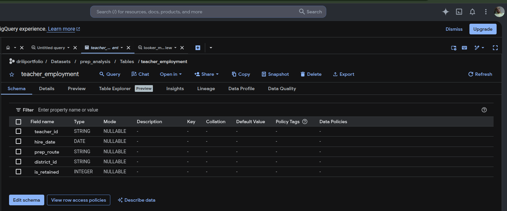
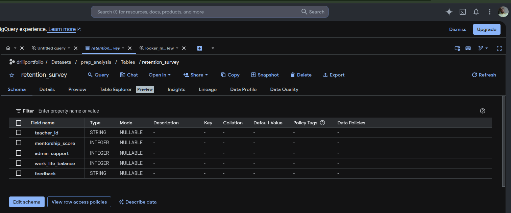
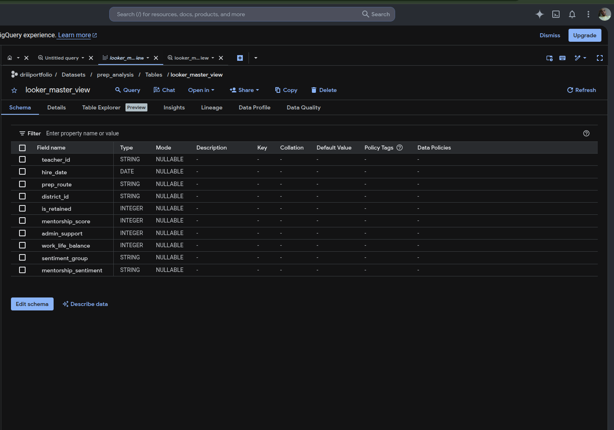
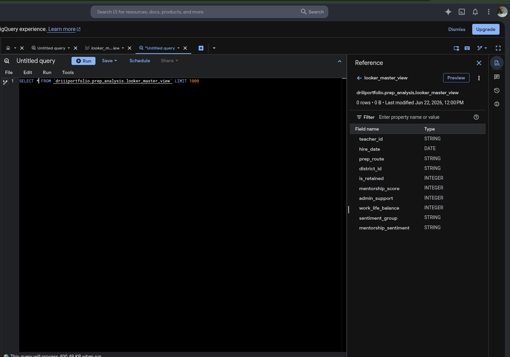
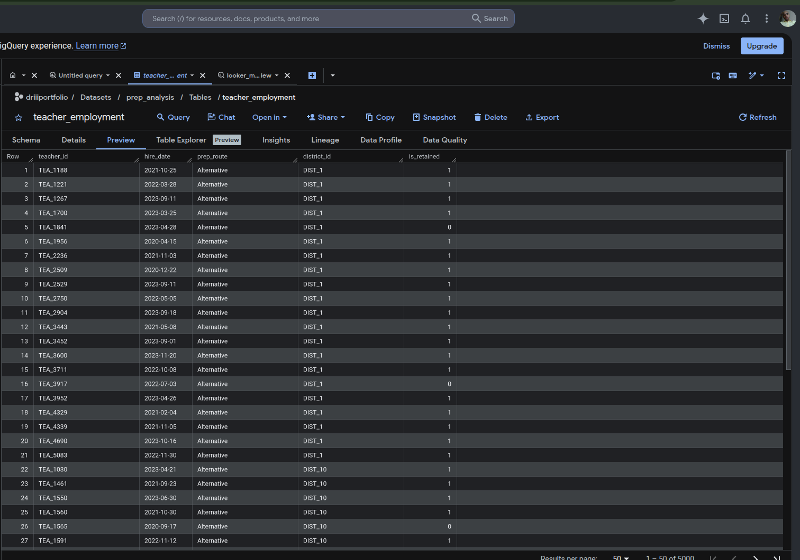
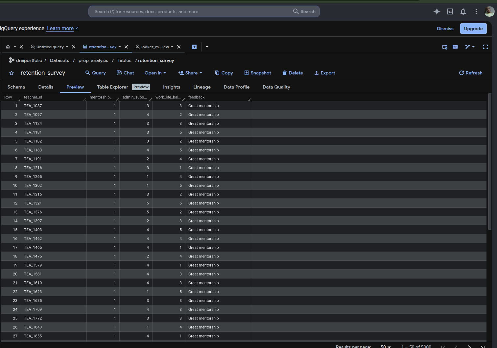
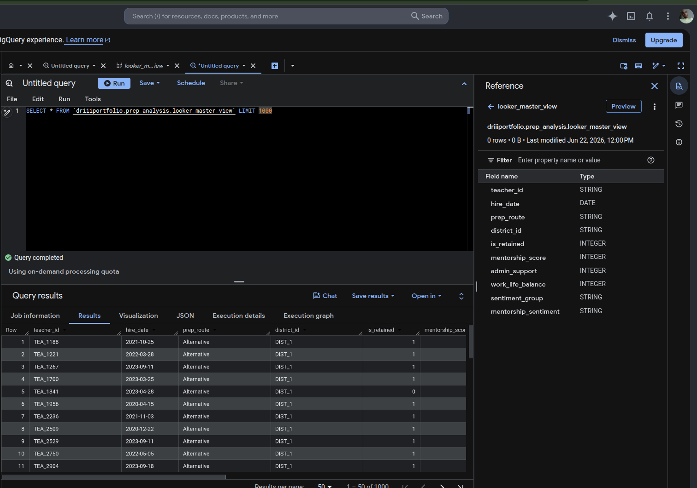
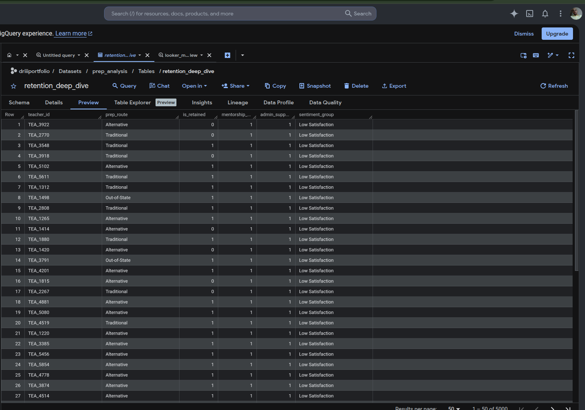

# **RetentionInsight:** Texas Educator Pipeline Analysis
---
#### **Data Analyst:** Daniel Rodriguez III
#### **Date:** June 22, 2026
---
# **Project Overview**
**RetentionInsight** is an end-to-end data engineering and causal analytics framework designed to model educator retention trends within the Texas Education Agency (TEA) policy context. This project serves as a professional demonstration of the complete data lifecycle—from synthetic data generation and ETL pipeline design to building actionable, audit-ready analytical dashboards.

# **Architecture**
The pipeline follows a robust, industry-standard lifecycle:
1. **Ingestion & Staging:** Python (Colab) generates synthetic datasets mirroring state-level HR/Survey systems.
2. **Data Warehouse:** BigQuery acts as the centralized repository, enforcing data integrity and modular SQL transformations.
3. **Analytics & Visualization:** Looker Studio provides the executive reporting layer, featuring a 3-tier sentiment segmentation model to identify retention risks.

# **Repository Structure**
- `/sql/`: Contains all DDL (Schema) and DML (Transformation/Analysis) queries.
- `/src/`: Python source code for data generation.
- `/docs/`: Architectural documentation and methodology.
- `/assets/`: Dashboard previews and visual reports.

---
# **Technical Documentation & Data Architecture**

This project utilizes a modular documentation structure to maintain clear data lineage, governance, and transformation transparency across the educator retention analytics pipeline.

---

## 1. Data Modeling & Integrity

**Purpose:** These documents illustrate the strict data contracts and schema definitions that support the pipeline.

### Documentation: Schema Definitions

| Schema | Description |
|----------|-------------|
| [teacher_employment_schema.png](docs/Schema/teacher_employment_schema.png) | Defines the core HR and employment data contract. |
| [retention_survey_schema.png](docs/Schema/retention_survey_schema.png) | Details qualitative survey attributes and educator feedback dimensions. |
| [looker_master_view_schema.png](docs/Schema/looker_master_view_schema.png) | Visualizes the final analytical warehouse structure used for reporting. |

#### Teacher Employment Schema

#### Retention Survey Schema

#### Looker Master View Schema

**Narrative**

> This schema design enforces strict type constraints and standardized field definitions, ensuring that fields such as `hire_date`, `certification_route`, and `is_retained` maintain integrity throughout downstream ETL processes and reporting workflows.

---

## 2. SQL Transformation Logic

**Purpose:** Demonstrates SQL development and warehouse transformation methodologies used to create analytical reporting views.

### Documentation: Transformation Logic

| Logic Asset | Description |
|-------------|-------------|
| [looker_master_view_query.png](docs/Logic/looker_master_view_query.png) | Primary SQL transformation logic used to generate the reporting layer. |

#### Looker Master View Query Logic

**Narrative**

> The query illustrated in `looker_master_view_query.png` implements a robust sentiment segmentation framework that transforms raw survey responses into actionable educator cohorts including **Satisfied**, **Neutral**, and **Detractor** classifications.

---

## 3. Data Validation & Pipeline Health

**Purpose:** Demonstrates quality assurance procedures performed during data staging and ingestion.

### Documentation: Data Validation

| Validation Asset | Description |
|------------------|-------------|
| [teacher_employment_preview.png](docs/Validation/teacher_employment_preview.png) | Sample preview of educator employment records. |
| [retention_survey_preview.png](docs/Validation/retention_survey_preview.png) | Sample preview of educator survey responses. |

#### Teacher Employment Validation Preview

#### Retention Survey Validation Preview

**Narrative**

> Prior to ingestion, validation checks are performed to ensure that `teacher_id` values map correctly across employment and survey datasets. These controls prevent null-join failures, preserve referential integrity, and increase confidence in downstream analytics.

---

## 4. Analytical Output

**Purpose:** Highlights the final analytical products that power executive reporting and decision-making.

### Documentation: Analytical Previews

| Analytical Asset | Description |
|------------------|-------------|
| [looker_master_view_preview.png](docs/Analytics/looker_master_view_preview.png) | Integrated reporting dataset powering dashboard KPIs. |
| [retention_deep_dive_preview.png](docs/Analytics/retention_deep_dive_preview.png) | Advanced retention analysis dataset supporting detailed exploration. |

#### Looker Master View Preview

#### Retention Deep Dive Preview

**Narrative**

> These analytical previews represent the clean, integrated datasets that power executive reporting. The reporting layer combines quantitative employment outcomes with qualitative educator sentiment, enabling evidence-based retention strategies and program evaluation.

---

## Architecture Summary

The RetentionInsight pipeline follows a modern analytics architecture:

1. Source Data Collection
   - Employment Records
   - Educator Surveys

2. Data Validation
   - Quality Assurance Checks
   - Referential Integrity Validation

3. Data Transformation
   - SQL-Based Business Logic
   - Sentiment Classification
   - Retention Metric Engineering

4. Analytical Warehouse
   - `looker_master_view`
   - `retention_deep_dive`

5. Business Intelligence Layer
   - Looker Studio Executive Dashboard
   - Retention Risk Monitoring
   - District-Level Intervention Analysis

---

## **Disclaimer**
This project is an independent academic simulation intended solely to demonstrate technical proficiency in data architecture and analytics. All data is synthetic; it does not contain real agency information, nor does it represent official findings of the Texas Education Agency.
